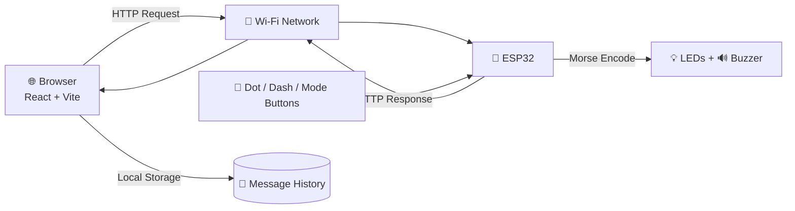
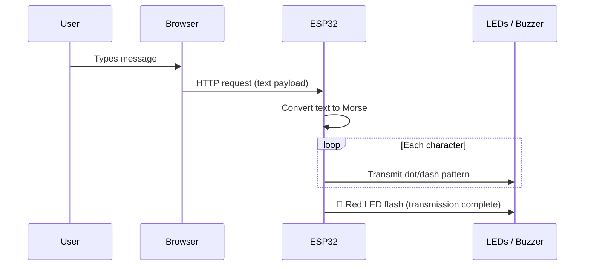
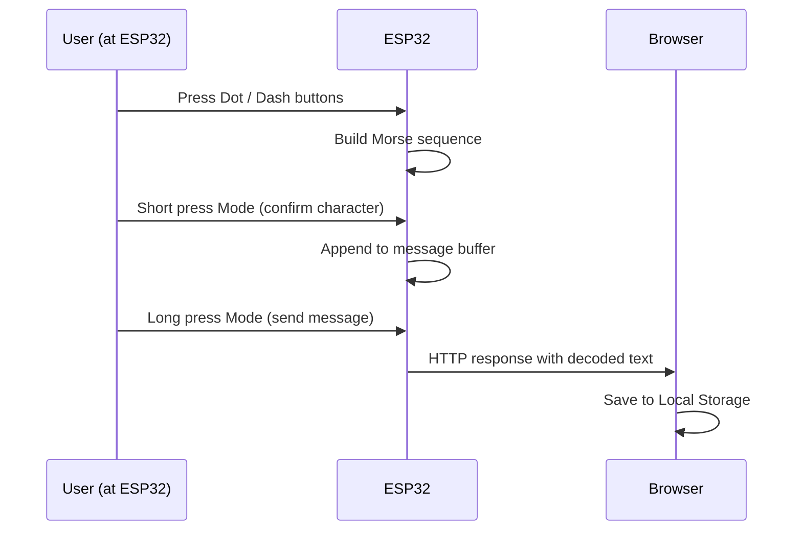

<div align="center">

# 📡 LynK

### Messages in Motion.

**A browser-based Morse communication system, physically transmitted through ESP32 hardware.**

[](https://lynk-v1-swart.vercel.app/)
[](#-license)
[](#-hardware)
[](#-tech-stack)
[](https://lynk-v1-swart.vercel.app/)

[Live Demo](https://lynk-v1-swart.vercel.app/) · [Repository](https://github.com/Srikarchaganti-01/Lynk_v1) · [Report an Issue](https://github.com/Srikarchaganti-01/Lynk_v1/issues)

</div>

## 📖 About

LynK bridges a web browser and physical hardware through Morse code. Type a message in the browser, and it travels over Wi-Fi to an ESP32, which transmits it as real dots and dashes — visible on LEDs and audible through a buzzer. The ESP32 can also encode Morse input from physical buttons and send it back to the browser.

It's not a Morse _converter_. It's a Morse _communicator_.

## ✨ Features

| Capability                   | Description                                                          |
| ---------------------------- | -------------------------------------------------------------------- |
| 🔤 Text → Morse transmission | Browser input is encoded and physically transmitted via LED + buzzer |
| 🔘 Hardware → Text reception | Dot/Dash/Mode buttons encode Morse, decoded on-device                |
| 💡 Visual signal feedback    | Dedicated LEDs for transmit, receive, spacing, and status            |
| 🔊 Authentic audio           | Passive buzzer reproduces real Morse timing and tone                 |
| 💾 Local message history     | Received messages persist via browser Local Storage                  |
| 🌐 Wi-Fi native              | Direct HTTP communication — no cloud dependency                      |

## 🤔 Why LynK

Most "Morse code" projects stop at text-to-symbol conversion in software. LynK closes the loop — the browser and the ESP32 are genuine communication endpoints, each capable of both sending and receiving, over a real physical medium.

---

## 🏗️ Project Architecture



### 📤 Browser → ESP32 Workflow



### 📥 Receiving Workflow



---

## 🔌 Hardware

| Component                              | Quantity |
| -------------------------------------- | -------- |
| ESP32                                  | 1        |
| LEDs (Green, Yellow, White, Red, Blue) | 5        |
| Passive Buzzer                         | 1        |
| Push Buttons                           | 3        |
| Breadboard                             | 1        |
| USB Power Supply                       | 1        |

### 💡 LED Indicator Reference

| LED       | Signal                                          |
| --------- | ----------------------------------------------- |
| 🟢 Green  | Transmission active                             |
| 🟡 Yellow | Blinks with dots and dashes during transmission |
| ⚪ White  | Lights on word-space during transmission        |
| 🔴 Red    | Brief flash when transmission completes         |
| 🔵 Blue   | Receive mode active                             |
| 🔊 Buzzer | Authentic Morse beep tones                      |

### 🎛️ Control Button Reference

| Button             | Action                                         |
| ------------------ | ---------------------------------------------- |
| Dot                | Adds a dot to the current Morse sequence       |
| Dash               | Adds a dash to the current Morse sequence      |
| Mode (short press) | Confirms current character, adds it to buffer  |
| Mode (long press)  | Sends the full buffered message to the browser |

---

## 🧰 Tech Stack

<div align="start">

| Layer         | Technology                               |
| ------------- | ---------------------------------------- |
| Frontend      | React · Vite · Tailwind CSS · JavaScript |
| Hardware      | ESP32 · Arduino IDE                      |
| Communication | HTTP over Wi-Fi                          |
| Storage       | Browser Local Storage                    |
| Deployment    | Vercel                                   |

</div>

---

## 📁 Folder Structure

```
Lynk_v1/
├── firmware/
│   └── lynk_esp32/
│       └── lynk_esp32.ino
├── src/
│   ├── components/
│   ├── hooks/
│   ├── utils/
│   └── App.jsx
├── public/
├── package.json
├── vite.config.js
└── README.md
```

---

## 🚀 Installation

### Prerequisites

- Node.js 18+
- Arduino IDE with ESP32 board support
- An ESP32 dev board

### 1. Clone the repository

```bash
git clone https://github.com/Srikarchaganti-01/Lynk_v1.git
cd Lynk_v1
```

### 2. Install frontend dependencies

```bash
npm install
```

<details>
<summary><strong>⚙️ ESP32 Setup</strong></summary>

<br>

1. Open `firmware/lynk_esp32/lynk_esp32.ino` in Arduino IDE.
2. Install the ESP32 board package via **Boards Manager**.
3. Update your Wi-Fi credentials in the sketch:

   ```cpp
   const char* ssid = "YOUR_WIFI_SSID";
   const char* password = "YOUR_WIFI_PASSWORD";
   ```

4. Select your ESP32 board and correct COM port.
5. Upload the sketch.
6. Open the Serial Monitor to confirm the assigned IP address.

</details>

<details>
<summary><strong>💻 Running Locally</strong></summary>

<br>

1. Point the frontend to your ESP32's IP address in the environment config.
2. Start the dev server:

   ```bash
   npm run dev
   ```

3. Open `http://localhost:5173` and ensure your browser and ESP32 are on the same Wi-Fi network.

</details>

---

## 🗺️ Future Roadmap

- [ ] End-to-end encryption
- [ ] Text file → Morse transmission
- [ ] Automatic retransmission until acknowledgement
- [ ] Replay previous transmissions
- [ ] Compact, PCB-based hardware revision
- [ ] OTA firmware updates
- [ ] Progressive Web App support
- [ ] Improved transmission animations

---

## 🤝 Contributing

Contributions are welcome. To propose a change:

1. Fork the repository
2. Create a feature branch (`git checkout -b feature/your-feature`)
3. Commit your changes
4. Open a pull request

Please keep hardware and firmware changes documented in your PR description.

---

## 📄 License

Distributed under the **MIT License**. See [`LICENSE`](./LICENSE) for details.

---

## 👤 Developer

<div align="center">

**Srikar Chaganti**

[](https://srikarchaganti-01.github.io/portfolio/)
[](https://github.com/Srikarchaganti-01)
[](https://linkedin.com/in/srikar-chaganti-57ba17319)

</div>

---

<div align="center">

### ⭐ If LynK sparked an idea, consider starring the repository

[](https://github.com/Srikarchaganti-01/Lynk_v1)

<sub>Built with ESP32, React, and a lot of blinking LEDs.</sub>

</div>
